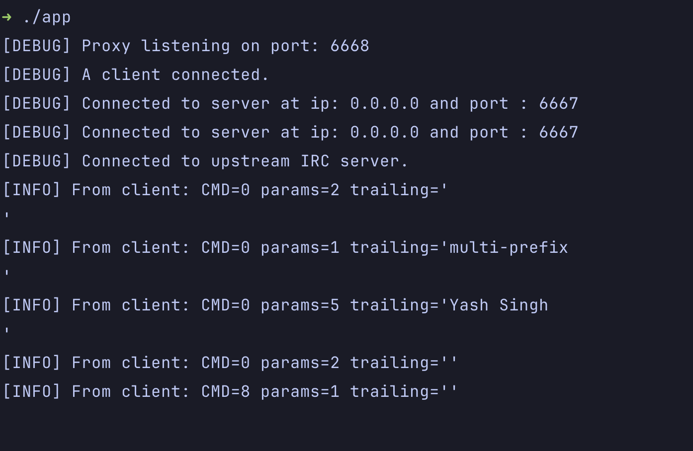

## Architecture
    [IRC Client] <---> [IFM Proxy]  <---> [IRC Server]

## Current status:
Proxy works yayyy!!! But does not do anything other than parsing the message b/w client and server.

## Install
> make
